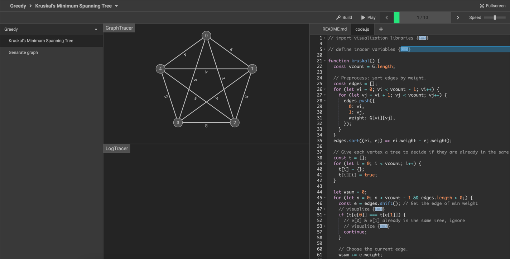

# Project CSD301

## Request:

- Use greedy algorithm for the Kruskal's Minimum Spanning Tree problem. A minimum spanning tree is a subset of a graph with the same number of vertices as the graph and edges equal to the number of vertices -1. It also has a minimal cost for the sum of all edge weights in a spanning tree.
- You must build a software that allow the user to define the vertices and the edges of the graph with the corresponding weights. Then your program must calculate and draw on the screen the corresponding graph as well as the MST of the graph.



## Algorithm:

---

- Use greedy algorithm for the Kruskal's Minimum Spanning Tree problem - Greedy Algorithm.
- Technology: Java.

## Software:

---

- Build a software to visualize the graph and the MST of the graph.
- Technology: ReactJS.

## Installation:

---

### 1. Clone the project

- You can download by click <a href="https://github.com/suwj6601/Project_CSD301" target="_blank"> here</a>
- Or you can clone the project by using the command below:

```
git clone https://github.com/suwj6601/Project_CSD301
```

### 2. Open the project in your IDE

- Open the project in your IDE( Netbeans, VSCode).

### Run algorithm:

- Run class main in folder **algorithm**.

### Run software:

#### First way:

- First you need to install nodejs and npm. (You can download <a href="https://nodejs.org/en/download/" target="_blank"> here</a>)
- Open terminal in folder software by using the command below:

```
cd software
```

- Install all dependencies by using the command below:

```
npm install
```

- Run the project by using the command below:

```
npm start
```

- Open your browser and go to the link below:

```
http://localhost:3000/
```

#### Another way:

- If you have **Docker** installed,
- Open terminal in folder software by using the command below:

```
cd software
```

- You can build the project by using the command below:

```
docker build -f Dockerfile -t software .
```

- After that, you can run the project by using the command below:

```
docker run -it -p 4002:3000 software
```

- Open your browser and go to the link below:

```
http://localhost:4002/
```
